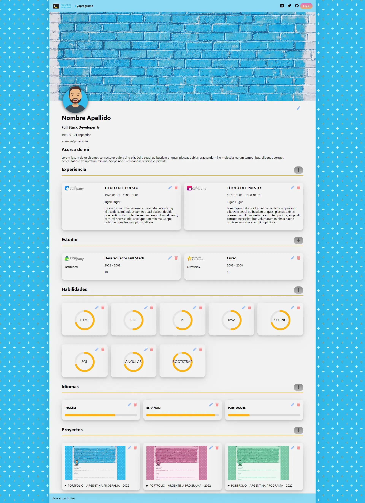

# porfolio-vainilla

(Trabajo en Progreso)

En este proyecto, con fines educativos, probamos como hacer el frontend de un porfolio usando html, css y javascript vainilla.
Para tener persistencia utilizamos la API localstorage de js.

